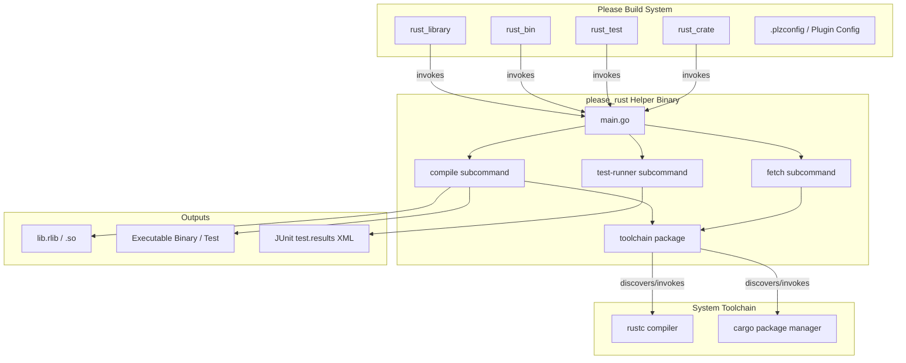
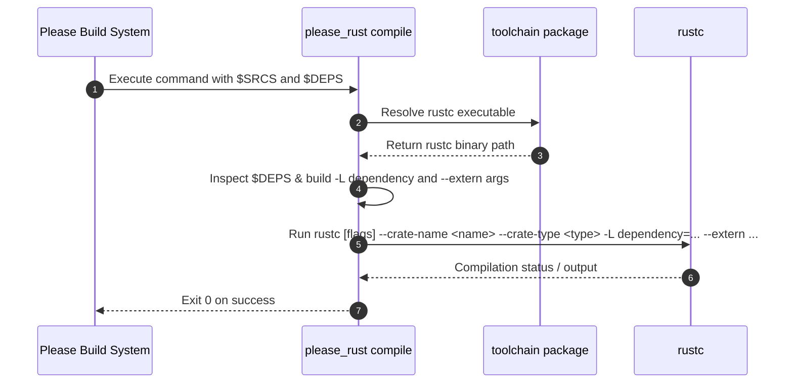
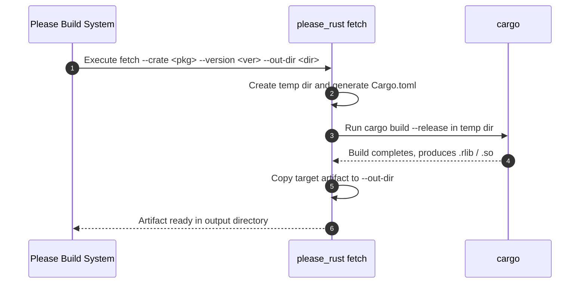

# Architecture & Internal Design

This document details the internal architecture and design of the Please Rust
rules plugin (`please-rules`).

---

## Overview

The Please Rust rules plugin replaces legacy bash scripts and dynamic filesystem
searches with a single, statically-compiled Go helper tool: `please_rust`
(`//tools/please_rust`).

When Please executes build or test rules defined in
`build_defs/rust/rust.build_defs`, it delegates compilation orchestration,
dependency resolution, test execution, and third-party crate fetching to
`please_rust`.

---

## Architecture Components

### 1. Starlark Build Definitions (`build_defs/rust/rust.build_defs`)

The Starlark build definitions expose user-facing rules (`rust_library`,
`rust_bin`, `rust_test`, and `rust_crate`). Instead of performing inline bash
shell loops or complex subprocess invocation in shell scripts, each Starlark
macro formats standard flags and passes `$SRCS` and `$DEPS` directly to the
`$TOOL` binary (`//tools/please_rust`).

### 2. Go Orchestrator (`tools/please_rust`)

Written in Go and compiled hermetically via Please's Go toolchain, `please_rust`
operates as a CLI tool with three primary subcommands:

#### `compile` Subcommand (`tools/please_rust/compile`)

- **Role**: Replaces legacy compiler invocation logic and dynamic `.rlib`
  resolution loops.
- **Arguments**:
  - `--out`: Target output file path (`.rlib`, `.so`, or binary executable
    path).
  - `--crate-name`: The crate name used in Rust module import paths.
  - `--crate-type`: `rlib`, `bin`, `proc-macro`, or `test`.
  - `--edition`: Rust edition (e.g. `2021`, `2024`).
  - `--main-src`: The root entrypoint file (e.g. `lib.rs` or `main.rs`).
  - `--version`: Optional version parameter passed to `--cfg` or
    `CARGO_PKG_VERSION`.
  - `--flags`: Additional flags passed directly to `rustc`.
  - `--rustc`: Optional path override for the `rustc` binary.
  - Positioning arguments / `$SRCS` & `$DEPS`: Source files and input dependency
    files (`.rlib`, `.so`).
- **Dependency Handling**: `compile` parses the provided inputs. For each
  `.rlib` or `.so` dependency, it determines the crate name, adds parent
  directories as library search paths (`-L dependency=<dir>`), and adds
  `--extern <crate>=<path>` parameters.

#### `fetch` Subcommand (`tools/please_rust/fetch`)

- **Role**: Fetches and builds external third-party crates.
- **Arguments**:
  - `--crate`: The name of the crate package on crates.io.
  - `--version`: The exact target version to fetch.
  - `--features`: Comma-separated list of enabled Cargo features.
  - `--proc-macro`: Boolean flag indicating whether the target crate is a
    procedural macro (outputs `.so`).
  - `--out-dir`: Destination directory to store compiled artifacts (`.rlib` or
    `.so`).
  - `--cargo` / `--rustc`: Optional executable path overrides.
- **Execution Strategy**:
  1. Creates a temporary workspace directory containing a generated
     `Cargo.toml`.
  2. Runs `cargo check` / `cargo build --release` targeting the temporary
     workspace.
  3. Locates generated `.rlib` or `.so` files in Cargo's target output directory
     and copies them to `--out-dir`.

#### `test-runner` Subcommand (`tools/please_rust/testrunner`)

- **Role**: Executes Rust test executables built with `--test` and converts test
  output into JUnit XML format for Please reporting.
- **Arguments**:
  - `--pkg`: Target package name for test output attribution.
  - `--results-file`: Path to write the JUnit XML results (default:
    `test.results`).
  - `test_binary` and extra arguments.
- **Output Parsing**: Executes the Rust unit test binary, captures console log
  streams live, parses test passes/failures/ignores, and writes a standard JUnit
  XML results file.

---

## Toolchain Resolution (`tools/please_rust/toolchain`)

The `toolchain` package resolves system toolchain binaries (`rustc` and
`cargo`):

1. **Explicit Flag / Config Override**: If `--rustc` or `--cargo` is specified
   (from `.plzconfig` plugin settings), `please_rust` uses that exact binary
   path.
2. **Environment Path Search**: If unset or empty, `please_rust` searches
   standard locations:
   - System `$PATH`
   - `$HOME/.cargo/bin/rustc` / `$HOME/.cargo/bin/cargo`
   - `/home/linuxbrew/.linuxbrew/bin/rustc`
   - `/usr/local/bin/rustc` / `/usr/bin/rustc`
