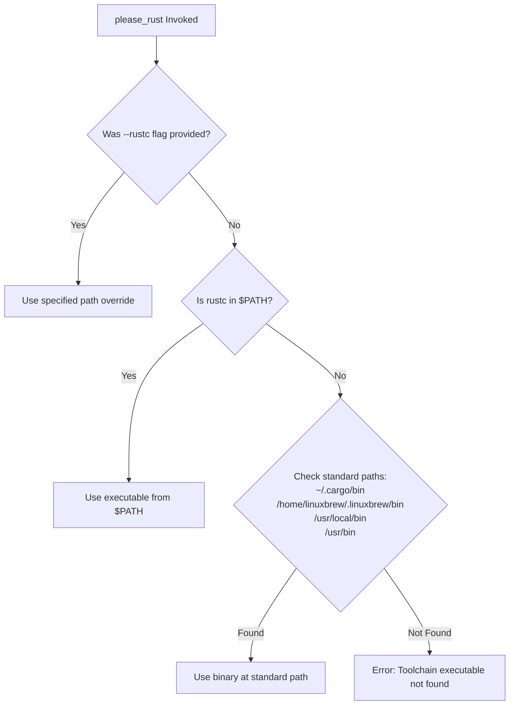

# Toolchain Dependencies & Resolution

This document details system requirements, toolchain discovery mechanisms, and
third-party crate dependency management in the Please Rust plugin
(`please-rules`).

---

## Toolchain Requirements

To compile and test Rust targets, the system requires:

1. **Rust Toolchain**:
   - `rustc`: The standard Rust compiler executable.
   - `cargo`: Optional / legacy fallback only. Standard third-party crate compilation
     in `please-rules` is completely Cargo-free.
2. **C Compiler (for native extensions)**:
   - `cc`, `gcc`, or `clang` and `ar`: Used by `compile-c` when compiling crates
     with embedded C sources (e.g., Tree-sitter grammar parsers).
3. **Go Toolchain**:
   - Required by Please to build the `please_rust` helper binary
     (`//tools/please_rust`). Please manages Go toolchains hermetically via the
     `go-rules` plugin (`//plugins:go`).

---

## Toolchain Resolution & Discovery

When `please_rust` executes, it uses its built-in `toolchain` module to locate
the host `rustc` executable.

### Resolution Hierarchy



### Config Overrides via `.plzconfig`

Toolchain paths can be explicitly set in your project's `.plzconfig`:

```ini
[Plugin "rust"]
Target = //plugins:rust
RustcTool = /usr/local/bin/rustc
PleaseRustTool = //tools/please_rust
```

When set, these configuration keys are automatically passed as `--rustc`
flags to `please_rust`.

---

## Third-Party Crate Dependency Management

Third-party dependencies are declared using the `rust_crate` rule, typically
organized inside `third_party/rust/BUILD`.

### 1. Simple Crate Dependency

```starlark
# third_party/rust/BUILD
rust_crate(
    name = "itoa",
    version = "1.0.14",
    sha256 = "d75a2a4b1b190afb6f5425f10f6a8f959d2ea0b9c2b1d79553551850539e4674",
    visibility = ["PUBLIC"],
)
```

### 2. Crate with Features & Dependencies

When a third-party crate depends on another crate or requires specific features:

```starlark
rust_crate(
    name = "serde",
    version = "1.0.217",
    sha256 = "02fc4265df13d6fa1d00ecff087228cc0a2b5f3c0e87e258d8b94a156e984c70",
    features = ["derive", "std"],
    deps = [
        ":serde_derive",
    ],
    visibility = ["PUBLIC"],
)

rust_crate(
    name = "serde_derive",
    version = "1.0.217",
    sha256 = "5a9bf7cf98d04a2b28aead066b7496853d4779c9cc183c440dbac457641e19a0",
    proc_macro = True,
    deps = [":syn", ":quote", ":proc-macro2"],
    visibility = ["PUBLIC"],
)
```

### 3. Meta / Grouping Crates

Meta crates group multiple dependencies together:

```starlark
rust_crate(
    name = "tree-sitter-all",
    meta = True,
    deps = [
        ":tree-sitter",
        ":tree-sitter-python",
        ":tree-sitter-rust",
    ],
    visibility = ["PUBLIC"],
)
```

### How `rust_crate` Works Under the Hood

1. **Download Phase (`_download_<name>`)**:
   - `please_rust download` fetches the `.crate` tarball directly from `https://static.crates.io/crates/<crate>/<crate>-<version>.crate`.
   - Computes and verifies the SHA-256 hex digest against `sha256`. Fails with a security alert on any mismatch.
   - Extracts the tarball into a sandbox, inspects `Cargo.toml` for `edition` and the entrypoint path (`lib.rs`), and writes `crate_meta.json`.
   - Repacks the crate contents as a plain tarball output.
2. **Native C Compilation Phase (`_c_<name>`, optional)**:
   - If `c_srcs` are provided, `please_rust compile-c` compiles the specified C source files into object files using `cc` and archives them into `lib<crate>.a` using `ar rcs`.
3. **Compilation Phase**:
   - Extracts the source tarball and executes `please_rust compile`.
   - Reads `crate_meta.json` to configure the source path and edition.
   - Automatically maps all dependency artifacts from `$DEPS` into `--extern <crate>=<path>` and `-L dependency=<dir>`.
   - If a native library archive exists, adds `-L native=<dir> -l static=<lib>`.
   - Directly executes `rustc` to produce the final `.rlib` (or `.so` for procedural macros).
