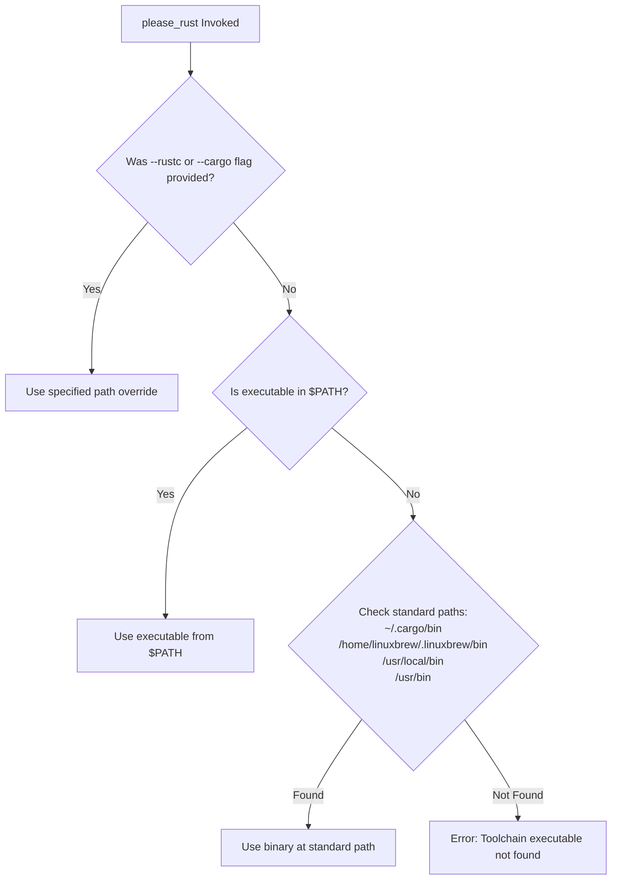

# Toolchain Dependencies & Resolution

This document details system requirements, toolchain discovery mechanisms, and
third-party crate dependency management in the Please Rust plugin
(`please-rules`).

---

## Toolchain Requirements

To compile and test Rust targets, the system requires:

1. **Rust Toolchain**:
   - `rustc`: The standard Rust compiler executable.
   - `cargo`: The Rust package manager (used by `please_rust fetch` to download
     and compile third-party crates).
2. **Go Toolchain**:
   - Required by Please to build the `please_rust` helper binary
     (`//tools/please_rust`). Please manages Go toolchains hermetically via the
     `go-rules` plugin (`//plugins:go`).

---

## Toolchain Resolution & Discovery

When `please_rust` executes, it uses its built-in `toolchain` module to locate
the host `rustc` and `cargo` executables.

### Resolution Hierarchy



### Config Overrides via `.plzconfig`

Toolchain paths can be explicitly set in your project's `.plzconfig`:

```ini
[Plugin "rust"]
Target = //plugins:rust
RustcTool = /usr/local/bin/rustc
CargoTool = /usr/local/bin/cargo
PleaseRustTool = //tools/please_rust
```

When set, these configuration keys are automatically passed as `--rustc` and
`--cargo` flags to `please_rust`.

---

## Third-Party Crate Dependency Management

Third-party dependencies are declared using the `rust_crate` rule, typically
organized inside `third_party/rust/BUILD`.

### 1. Simple Crate Dependency

```starlark
# third_party/rust/BUILD
rust_crate(
    name = "itoa",
    version = "1.0.10",
    visibility = ["PUBLIC"],
)
```

### 2. Crate with Features & Dependencies

When a third-party crate depends on another crate or requires specific Cargo
features:

```starlark
rust_crate(
    name = "serde",
    version = "1.0.197",
    features = ["derive", "std"],
    deps = [
        ":serde_derive",
    ],
    visibility = ["PUBLIC"],
)

rust_crate(
    name = "serde_derive",
    version = "1.0.197",
    proc_macro = True,
    visibility = ["PUBLIC"],
)
```

### 3. Meta / Grouping Crates

Meta crates group multiple dependencies together:

```starlark
rust_crate(
    name = "tree-sitter-all",
    meta = True,
    deps = [
        ":tree-sitter",
        ":tree-sitter-python",
        ":tree-sitter-rust",
    ],
    visibility = ["PUBLIC"],
)
```

### How `rust_crate` Works Under the Hood

1. Please invokes `$TOOL fetch` with parameters `--crate`, `--version`,
   `--features`, and `--out-dir`.
2. `please_rust fetch` constructs a isolated temporary workspace directory and
   creates a minimal `Cargo.toml`.
3. It runs `cargo build --release` using Cargo.
4. The generated `.rlib` (or `.so` for procedural macros) is placed in Please's
   target output directory (`plz-out/`).
5. Dependent targets (`rust_library`, `rust_bin`) reference this artifact
   directly via `--extern` and `-L dependency=...`.
