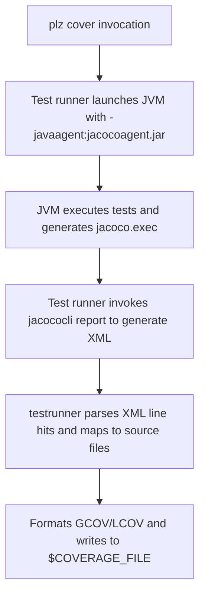
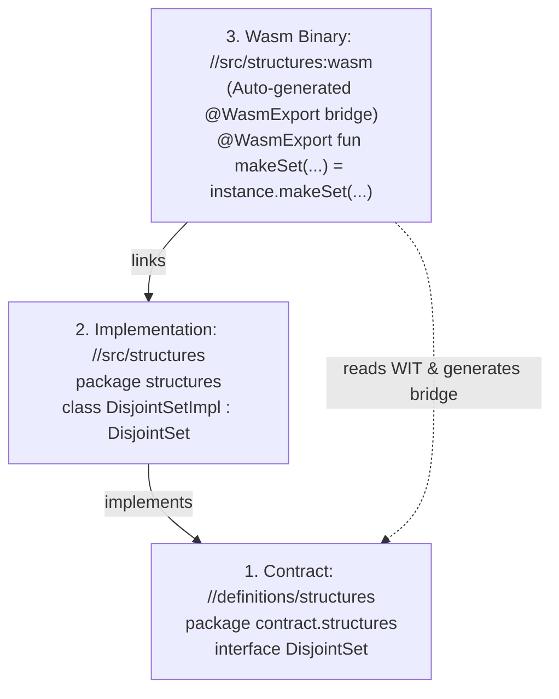

# Kotlin Rules Architecture

This document describes the architectural design of `please-rules`'s Kotlin
toolchain, compiler orchestration, and code coverage pipeline.

---

## 1. Hermetic Toolchain (`kotlin_toolchain`)

The `kotlin_toolchain` rule downloads standalone distribution archives and
packages a self-contained sysroot:

```txt
plz-out/gen/third_party/kotlin/toolchain/
├── bin/
│   ├── kotlinc       # Hermetic bash launcher pointing to bundled JDK
│   ├── kotlin        # Hermetic runner pointing to bundled JDK
│   ├── java          # Symlink to jdk/bin/java
│   └── jar           # Symlink to jdk/bin/jar
├── jdk/              # Full Eclipse Adoptium / Temurin OpenJDK 21 distribution
├── kotlinc/          # Standalone JetBrains Kotlin 2.1.x distribution
│   ├── bin/
│   └── lib/          # kotlin-stdlib.jar, kotlin-reflect.jar, etc.
└── jacoco/
    ├── jacocoagent.jar
    └── jacococli.jar
```

### Hermeticity Mechanism

The `kotlinc` and `kotlin` scripts in `bin/` explicitly set `JAVA_HOME` and
prepend `jdk/bin` to `PATH`, ensuring that Kotlin compilation and execution
never invoke the host machine's Java runtime or environment.

---

## 2. CLI Helper (`tools/please_kotlin`)

Written in Go and compiled with Please's hermetic Go toolchain, `please_kotlin`
orchestrates build actions:

- **`compile`**:
  - Validates source files and dependency JARs.
  - Constructs classpath (`-cp`) arguments.
  - Invokes `kotlinc` with `-d <tmp_classes>`, `-jvm-target`, and
    `-module-name`.
  - Packages compiled `.class` files into standard `.jar` archives with
    generated `META-INF/MANIFEST.MF`.
- **`testrunner`**:
  - Invokes the test JVM with all test dependencies on the classpath.
  - Intercepts stdout and stderr to parse test status and timings.
  - Generates standard `test.results` JUnit XML.
  - Injects `-javaagent` when `$COVERAGE` or `$COVERAGE_FILE` is set.
  - Parses JaCoCo execution data via `jacococli` and normalizes paths to
    repository-relative paths.

---

## 3. Code Coverage Pipeline

When running `./pleasew cover //...`:



Please parses the resulting file to display line-by-line coverage metrics in the
terminal and HTML reports.

---

## 4. WebAssembly Compilation Pipeline (`tools/please_kotlin_wasm`)

For WebAssembly targets, `please-rules` introduces a dedicated orchestrator tool
(`tools/please_kotlin_wasm`) separate from the JVM compiler helper.

### Two-Phase Compilation Architecture

Kotlin's K2 compiler requires a two-phase pipeline to produce WebAssembly
modules:


1. **Phase 1 (KLIB Generation)**: Compiles Kotlin sources against the Kotlin
   Wasm standard library (`kotlin-stdlib-wasm-*.klib`) into an intermediate
   library format (`.klib`).
2. **Phase 2 (Wasm Linking)**: Links the intermediate `.klib` into the final
   WebAssembly bytecode (`.wasm`) and companion JavaScript glue (`.mjs`).

### Library Wasm vs. Command Wasm

WebAssembly distinguishes between two types of modules:

- **Reactor / Library Wasm (`-main noCall`, default)**: Contains no `main()`
  routine. Functions annotated with `@WasmExport` are exported to the
  WebAssembly export table and can be invoked directly by external runtimes
  (Python via `wasmtime`, Node.js/browsers via `WebAssembly.instantiate`, Go via
  `wazero`).
- **Command / Executable Wasm (`-main call`)**: Contains an active entry point
  that executes `fun main()` upon module instantiation.

### The 3-Tier DAG (Zero Circular Dependencies)

When building WebAssembly modules from shared interface specifications (e.g.
WIT):



- **Contracts** define pure interfaces from `.wit` or shared definitions and
  depend on nothing.
- **Implementations** implement the interface and depend only on the contract.
- **Binary targets (`kt_wasm_binary`)** automatically parse the WIT contract,
  generate the `@WasmExport` bridge to instantiate and delegate to the
  implementation class, and compile the final `.wasm` library without requiring
  manual bridge authoring or circular dependencies.
