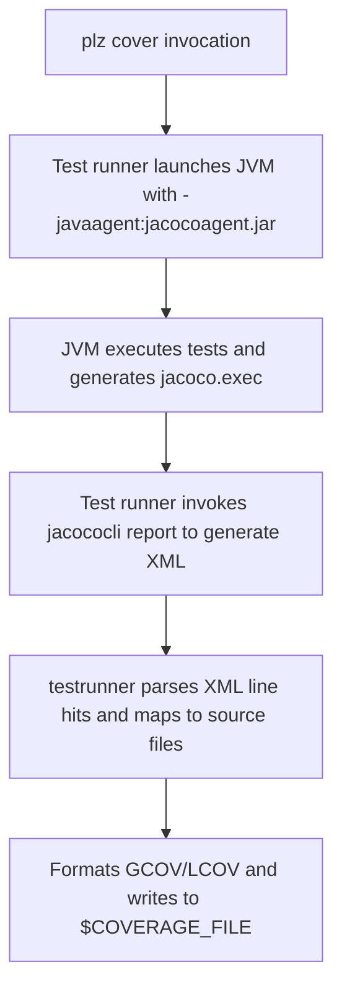

# Kotlin Rules Architecture

This document describes the architectural design of `please-rules`'s Kotlin
toolchain, compiler orchestration, and code coverage pipeline.

---

## 1. Hermetic Toolchain (`kotlin_toolchain`)

The `kotlin_toolchain` rule downloads standalone distribution archives and
packages a self-contained sysroot:

```txt
plz-out/gen/third_party/kotlin/toolchain/
├── bin/
│   ├── kotlinc       # Hermetic bash launcher pointing to bundled JDK
│   ├── kotlin        # Hermetic runner pointing to bundled JDK
│   ├── java          # Symlink to jdk/bin/java
│   └── jar           # Symlink to jdk/bin/jar
├── jdk/              # Full Eclipse Adoptium / Temurin OpenJDK 21 distribution
├── kotlinc/          # Standalone JetBrains Kotlin 2.1.x distribution
│   ├── bin/
│   └── lib/          # kotlin-stdlib.jar, kotlin-reflect.jar, etc.
└── jacoco/
    ├── jacocoagent.jar
    └── jacococli.jar
```

### Hermeticity Mechanism

The `kotlinc` and `kotlin` scripts in `bin/` explicitly set `JAVA_HOME` and
prepend `jdk/bin` to `PATH`, ensuring that Kotlin compilation and execution
never invoke the host machine's Java runtime or environment.

---

## 2. CLI Helper (`tools/please_kotlin`)

Written in Go and compiled with Please's hermetic Go toolchain, `please_kotlin`
orchestrates build actions:

- **`compile`**:
  - Validates source files and dependency JARs.
  - Constructs classpath (`-cp`) arguments.
  - Invokes `kotlinc` with `-d <tmp_classes>`, `-jvm-target`, and
    `-module-name`.
  - Packages compiled `.class` files into standard `.jar` archives with
    generated `META-INF/MANIFEST.MF`.
- **`testrunner`**:
  - Invokes the test JVM with all test dependencies on the classpath.
  - Intercepts stdout and stderr to parse test status and timings.
  - Generates standard `test.results` JUnit XML.
  - Injects `-javaagent` when `$COVERAGE` or `$COVERAGE_FILE` is set.
  - Parses JaCoCo execution data via `jacococli` and normalizes paths to
    repository-relative paths.

---

## 3. Code Coverage Pipeline

When running `./pleasew cover //...`:



Please parses the resulting file to display line-by-line coverage metrics in the
terminal and HTML reports.
