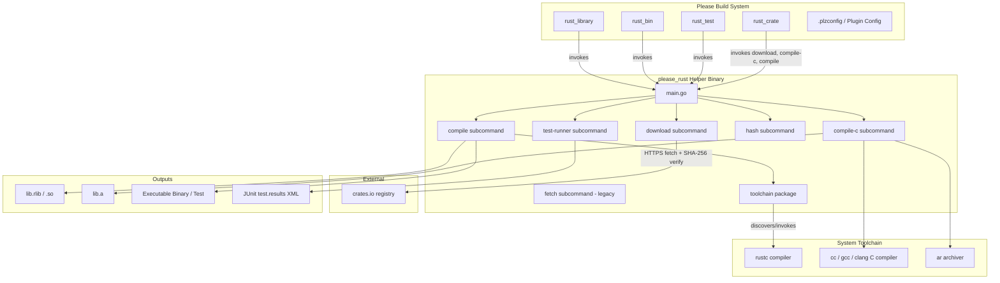
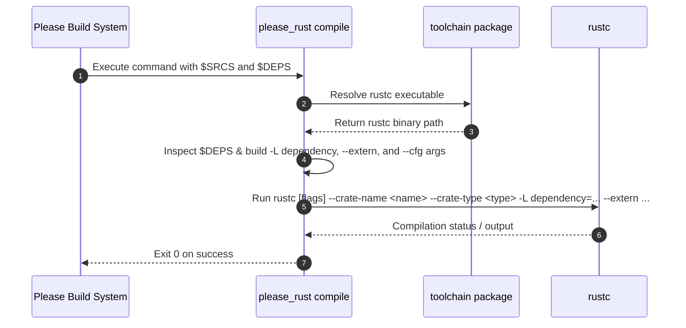
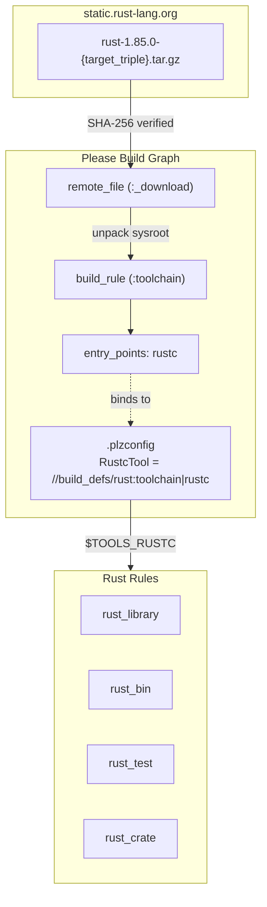

# Architecture & Internal Design

This document details the internal architecture and design of the Please Rust
rules plugin (`please-rules`).

---

## Overview

The Please Rust rules plugin replaces legacy bash scripts and dynamic filesystem
searches with a single, statically-compiled Go helper tool: `please_rust`
(`//tools/please_rust`).

When Please executes build or test rules defined in
`build_defs/rust/rust.build_defs`, it delegates compilation orchestration,
dependency resolution, test execution, and third-party crate fetching to
`please_rust`.

---

## Architecture Components

### 1. Starlark Build Definitions (`build_defs/rust/rust.build_defs`)

The Starlark build definitions expose user-facing rules (`rust_library`,
`rust_bin`, `rust_test`, and `rust_crate`). Instead of performing inline bash
shell loops or complex subprocess invocation in shell scripts, each Starlark
macro formats standard flags and passes `$SRCS` and `$DEPS` directly to the
`$TOOL` binary (`//tools/please_rust`).

### 2. Go Orchestrator (`tools/please_rust`)

Written in Go and compiled hermetically via Please's Go toolchain, `please_rust`
operates as a multi-subcommand CLI tool:

#### `compile` Subcommand (`tools/please_rust/compile`)

- **Role**: Replaces legacy compiler invocation logic and dynamic `.rlib`
  resolution loops.
- **Arguments**:
  - `--out`: Target output file path (`.rlib`, `.so`, or binary executable
    path).
  - `--crate-name`: The crate name used in Rust module import paths.
  - `--crate-type`: `rlib`, `bin`, `proc-macro`, or `test`.
  - `--edition`: Rust edition (e.g. `2021`, `2024`).
  - `--main-src`: The root entrypoint file (e.g. `lib.rs` or `main.rs`).
  - `--meta`: Path to `crate_meta.json` generated by `download`.
  - `--features`: Comma-separated list of enabled features (translated to
    `--cfg feature="<name>"`).
  - `--native-lib`: Path to a static library archive (`.a`) to link via
    `-L native=<dir> -l static=<lib>`.
  - `--version`: Crate version parameter, automatically populates
    `CARGO_PKG_VERSION`, `CARGO_PKG_VERSION_MAJOR`, `CARGO_PKG_VERSION_MINOR`,
    and `CARGO_PKG_VERSION_PATCH`.
  - `--flags`: Additional flags passed directly to `rustc`.
  - `--rustc`: Optional path override for the `rustc` binary.
  - Positioning arguments / `$SRCS` & `$DEPS`: Source files and input dependency
    files (`.rlib`, `.so`).
- **Dependency Handling**: `compile` parses the provided inputs. For each
  `.rlib` or `.so` dependency, it determines the crate name, adds parent
  directories as library search paths (`-L dependency=<dir>`), and adds
  `--extern <crate>=<path>` parameters. For `proc-macro` crates, it
  automatically appends `--extern proc_macro`.

#### `download` Subcommand (`tools/please_rust/download`)

- **Role**: Hermetically fetches `.crate` tarballs from `crates.io`, verifies
  cryptographic integrity, inspects crate metadata, and produces a plain
  tarball.
- **Arguments**:
  - `--crate`: Crate name on `crates.io`.
  - `--version`: Exact package version.
  - `--sha256`: Expected SHA-256 hex digest. Fails immediately with security
    warning on mismatch.
  - `--out`: Destination path for repacked tarball.
- **Metadata Extraction**: Unpacks the `.crate` (gzipped tar), parses
  `Cargo.toml` to extract `edition` and the entrypoint source path (`lib.rs`),
  writes `crate_meta.json`, and repacks the crate as a standard tar archive.

#### `compile-c` Subcommand (`tools/please_rust/compilec`)

- **Role**: Compiles native C sources (`.c`) and header directories (`-I`) into
  a static archive (`.a`) using the system C compiler (`cc`/`gcc`/`clang`) and
  `ar rcs`.
- **Arguments**:
  - `--out`: Destination static archive path (`lib<name>.a`).
  - `--include`: Repeatable header search directory flag (`-I`).
  - Positional arguments: Source `.c` file paths.

#### `hash` Subcommand

- **Role**: Queries and prints the SHA-256 digest of any crate from `crates.io`
  to simplify declaring new `rust_crate` rules.

#### `test-runner` Subcommand (`tools/please_rust/testrunner`)

- **Role**: Executes Rust test executables built with `--test` and converts test
  output into JUnit XML format for Please reporting.
- **Arguments**:
  - `--pkg`: Target package name for test output attribution.
  - `--results-file`: Path to write the JUnit XML results (default:
    `test.results`).
  - `test_binary` and extra arguments.
- **Output Parsing**: Executes the Rust unit test binary, captures console log
  streams live, parses test passes/failures/ignores, and writes a standard JUnit
  XML results file.

---

## Toolchain Resolution (`tools/please_rust/toolchain`)

The `toolchain` package resolves compiler binaries (`rustc` and `cargo`):

1. **Explicit Flag / Config Override**: If `--rustc` or `--cargo` is specified
   (from `.plzconfig` plugin settings or build rule `tools`), `please_rust` uses
   that exact binary path. When a Please build target or entry point is provided
   (e.g. `//build_defs/rust:toolchain|rustc`), Please resolves it as an
   execution tool dependency and sets `$TOOLS_RUSTC`.
2. **Environment Path Search**: If unset or empty, `please_rust` searches
   standard host locations as a fallback:
   - System `$PATH`
   - `$HOME/.cargo/bin/rustc` / `$HOME/.cargo/bin/cargo`
   - `/home/linuxbrew/.linuxbrew/bin/rustc`
   - `/usr/local/bin/rustc` / `/usr/bin/rustc`

---

## Hermetic Toolchain Architecture (`rust_toolchain`)

The `rust_toolchain` rule allows Please to construct a fully hermetic Rust
sysroot without relying on pre-installed host toolchains or environment holes
(`passenv = PATH, HOME`).

### Sysroot Assembly

1. **Lightweight Distribution**: `rust_toolchain` downloads the standalone
   `rustc` and `rust-std` component archives from `static.rust-lang.org` for the
   detected host triple (`x86_64-unknown-linux-gnu`,
   `aarch64-unknown-linux-gnu`, `x86_64-apple-darwin`, or
   `aarch64-apple-darwin`).
2. **Integrity Verification**: Archive SHA-256 digests are verified against
   pre-populated or user-specified hashes before extraction.
3. **Merging into `$OUT`**: Unpacks `bin/` and `lib/` components into a unified
   output directory target. Because standard Rust releases use
   `RUNPATH: $ORIGIN/../lib`, the compiler binary resolves its shared libraries
   without modifying `LD_LIBRARY_PATH`.
4. **Entry Point Exposure**: Exposes the `rustc` entry point
   (`:toolchain|rustc`), enabling direct consumption in `tools` mappings or via
   `[Plugin "rust"] RustcTool = //build_defs/rust:toolchain|rustc`.
