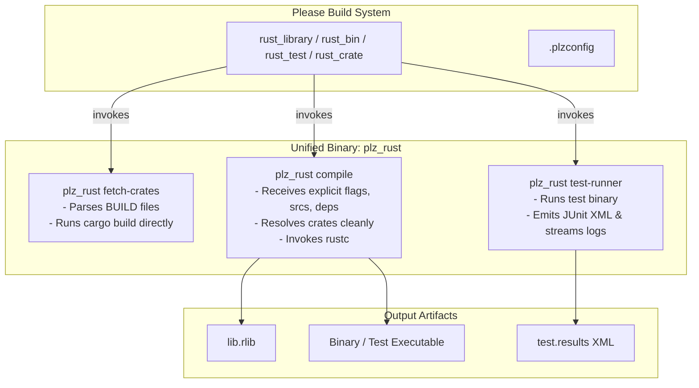

# Plan: Rust Build Rules Binary & Plugin Architecture

## Goal Description

Transform the Rust build definitions in `build_defs/rust/` into a robust,
reusable Please plugin (`rust-rules`) powered by a single compiled binary driver
(`plz_rust`).

This change achieves three main goals:

1. **Eliminates all dynamic shell `for` loops** from build scripts
   (`_RESOLVE_REPO_AND_DEPS_SH`, `find . -name "lib*.rlib"`,
   `ls -t "$TARGET_DEPS"/lib*.rlib`, and test runner path searching loops).
2. **Replaces separate scripts** (`fetch_crates.py`, `test_runner.py`, and
   inline bash compiler scripts) with a single unified binary (`plz_rust`).
3. **Packages the rules as a standalone Please Plugin** (`//plugins:rust` /
   `rust-rules`) with standard configuration options, ready to be reused across
   projects.

---

## Architecture Overview



---

## User Review Required

> [!IMPORTANT] **Implementation Language for `please_rust`**: To align with
> standard Please plugins (`please_go`, `please_pex` in `go-rules` and
> `python-rules`), `please_rust` will be written in **Go**. This provides:
>
> 1. Single static binary with zero external runtime dependencies.
> 2. Native compatibility with Please plugin distribution conventions.
> 3. Fast compilation via the repository's existing Go toolchain
>    (`//build_defs/go:toolchain`).

> [!NOTE] **Backward Compatibility**: The public rule signatures
> (`rust_library`, `rust_bin`, `rust_test`, `rust_crate`) will retain their
> current parameters (`name`, `srcs`, `deps`, `edition`, `flags`, `crate_name`,
> etc.), ensuring zero breaking changes to existing BUILD files in the monorepo
> (`//analyzer/...`).

---

## Proposed Changes

### Component 1: `please_rust` Helper Binary (Go)

A single static Go binary with subcommands matching the Please plugin tool
convention:

1. `compile`: Replaces bash loops in `_rust_compile_cmd`. Accepts explicit
   parameters:
   - `-o, --out`: Output artifact path (`.rlib` or binary)
   - `--crate-name`: Name of the crate
   - `--crate-type`: `rlib`, `bin`, `proc-macro`, or `test`
   - `--edition`: `2021` or `2024`
   - `--main-src`: Entrypoint file path
   - `--srcs`: Space-delimited or multi-flag source files
   - `--deps`: Space-delimited or multi-flag dependency paths (`.rlib`, `.so`)
   - `--flags`: Additional rustc flags
   - `--version`: Veritas / crate version
   - `--rustc`: Path to `rustc` (optional override)

   **Automated `rustc` Toolchain Discovery**:
   - `please_rust` checks `--rustc` flag, then standard system paths (`$PATH`,
     `~/.cargo/bin/rustc`, `/home/linuxbrew/.linuxbrew/bin/rustc`,
     `/usr/local/bin/rustc`, etc.).
   - If `rustc` is missing, it provides clear, actionable instructions or can
     invoke a bootstrap/download mechanism (analogous to `go_toolchain`).
   - Maps dependency files directly to `-L dependency=<dir>` and
     `--extern <crate>=<path>` without filesystem searching loops, and executes
     `rustc`.

2. `fetch`: Replaces `fetch_crates.py`. Reads the crate declarations from
   `third_party/rust/BUILD` and runs `cargo build`.
   - Discovers `cargo` via `$PATH` / standard toolchain paths.
   - Automatically builds third-party dependencies into the target cache
     directory.

3. `test`: Replaces `test_runner.py`. Executes the test binary, streams live
   console output, and generates standard JUnit XML `test.results`.

#### [NEW] `tools/please_rust/main.go`

#### [NEW] `tools/please_rust/compile/compile.go`

#### [NEW] `tools/please_rust/compile/compile_test.go`

#### [NEW] `tools/please_rust/fetch/fetch.go`

#### [NEW] `tools/please_rust/fetch/fetch_test.go`

#### [NEW] `tools/please_rust/testrunner/testrunner.go`

#### [NEW] `tools/please_rust/testrunner/testrunner_test.go`

#### [NEW] `tools/please_rust/toolchain/toolchain.go`

#### [NEW] `tools/please_rust/toolchain/toolchain_test.go`

#### [NEW] `tools/please_rust/BUILD`

---

### Component 2: Plugin Structure & Build Definitions

Restructure the Rust rules into a standard Please plugin structure:

```
plugins/rust/ (or build_defs/rust/ formatted as a Please plugin)
├── .plzconfig
├── BUILD
├── build_defs/
│   ├── BUILD
│   └── rust.build_defs
└── tools/
    ├── BUILD
    └── plz_rust
```

#### [MODIFY] `build_defs/rust/rust.build_defs`

- Eliminate `_RESOLVE_REPO_AND_DEPS_SH`.
- Eliminate the shell `for` loops in `_rust_compile_cmd`.
- Replace the bash compilation template with a direct call to
  `plz_rust compile`:

```starlark
def _rust_compile_cmd(crate, main_name, edition, flags_str, crate_type, is_test=False):
    type_arg = "test" if is_test else crate_type
    return f"""
    $TOOL compile \\
      --crate-name {crate} \\
      --crate-type {type_arg} \\
      --edition {edition} \\
      --out $OUT \\
      --main-src "{main_name}" \\
      --version "$VERITAS_VERSION" \\
      --flags "{flags_str}" \\
      $SRCS $DEPS
    """
```

- Simplify `rust_test` to use `$TOOL test-runner` directly instead of searching
  for runner paths in a `for` loop:

```starlark
test_cmd = f"$TEST_RUNNER --pkg {crate} ./$TEST $@"
```

#### [DELETE] `build_defs/rust/fetch_crates.py` (logic moved into `plz_rust`)

#### [DELETE] `build_defs/rust/test_runner.py` (logic moved into `plz_rust`)

---

### Component 3: Plugin Configuration & Registration

#### Root `.plzconfig` Registration

Just like the Python and Go plugins, user projects only need a single minimal
entry:

```ini
[Plugin "rust"]
Target = //plugins:rust
```

All other settings have sensible built-in defaults inside the plugin's
definition (`DefaultEdition = 2021`, `Rustc = rustc`, `Cargo = cargo`,
`RustTool = //tools:please_rust`), with optional overrides only when a project
needs custom toolchains.

---

## Verification Plan

### Automated Tests

1. **Tool Unit Tests**:
   - Test `plz_rust` parsing, CLI arguments, and JUnit XML generation.
2. **Repository Build & Test**:
   ```bash
   ./pleasew build //...
   ./pleasew test //...
   ```
3. **Clean Cache Test** (verify no reliance on pre-existing host state or
   lingering paths):
   ```bash
   ./pleasew clean
   ./pleasew test //...
   ```
4. **Third-Party Notices & Formatting**:
   ```bash
   find analyzer -name "*.rs" -exec rustfmt --check {} +
   ./pleasew run //scripts:generate_notices -- THIRD_PARTY_NOTICES.md
   ```

### Manual Verification

- Verify that `plz-out/log/test_results.xml` contains valid JUnit XML generated
  by `plz_rust test-runner`.
- Verify that third-party crates (`tree-sitter-*`, `serde`, `clap`, etc.) link
  cleanly without shell loop warnings.
