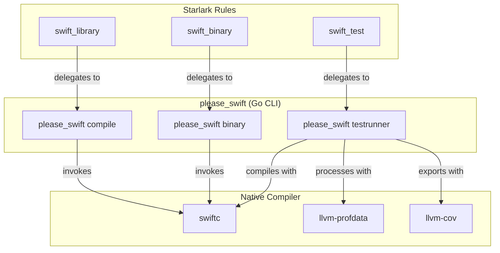
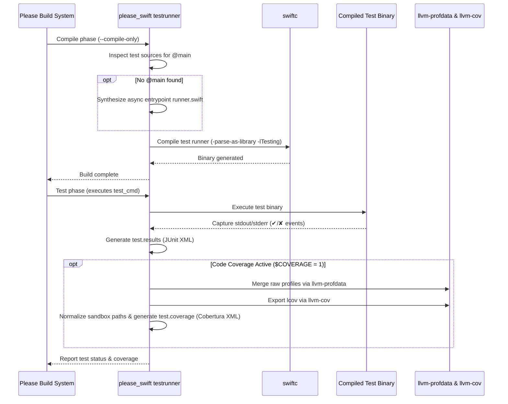

# Swift Rules Architecture & Design

This document details the internal architecture, compilation model, and test
execution pipeline of the Swift ruleset (`///swift`).

---

## High-Level Architecture

The Please Swift ruleset decouples build orchestrator logic from the Starlark
build definitions by using a dedicated Go CLI tool: **`please_swift`**.



---

## 1. Library Compilation Pipeline (`swift_library`)

When compiling a Swift library, `please_swift compile`:

1. **Dependency Inspection**:
   - Inspects transitive dependency folders passed via `${DEPS}`.
   - Discovers `swift_metadata.json` manifests emitted by upstream
     `swift_library` targets.
   - Collects `-I <dir>` module search paths and archive paths (`.a`).
2. **Compiler Invocation**:
   - Invokes `swiftc` with:
     - `-emit-library -static`
     - `-emit-module -emit-module-path <out>/<module>.swiftmodule`
     - `-module-name <module>`
     - `-parse-as-library`
   - Generates static archive `<module>.a` and interface files in `<out>/`.
3. **Coverage Instrumentation**:
   - If `$COVERAGE` is set to `true`, appends
     `-profile-generate -profile-coverage-mapping` flags to produce LLVM
     instrumented object code.
4. **Metadata Generation**:
   - Emits `<out>/swift_metadata.json` containing module name, archive path, and
     include directories.

```
<target_out>/
├── lib<name>.a
├── <name>.swiftmodule
├── <name>.swiftdoc
└── swift_metadata.json
```

---

## 2. Binary Linking Pipeline (`swift_binary`)

When building an executable binary, `please_swift binary`:

1. Identifies entrypoint (`main.swift` or struct decorated with `@main`).
2. Collects all transitive `.a` archives from dependencies.
3. Issues `swiftc` linking commands with `-static-stdlib` (on Linux) if
   configured.
4. Produces the final runnable binary.

---

## 3. Test Runner & Test Execution Pipeline (`swift_test`)

The test architecture supports modern `swift-testing` (`import Testing`) and
`XCTest`:



### Dynamic Main Synthesis for `swift-testing`

Modern Swift testing does not require an executable entry point in Xcode, but
when building with `swiftc` standalone, an executable entry point is needed.

If the user sources do not already declare an `@main` type,
`please_swift testrunner` synthesizes a minimal runner:

```swift
import Testing

#if canImport(Darwin)
import Darwin
#elseif canImport(Glibc)
import Glibc
#elseif canImport(Musl)
import Musl
#endif

@main
struct __PleaseSwiftRunnerMain {
    static func main() async {
        let code: CInt = await Testing.__swiftPMEntryPoint()
        exit(code)
    }
}
```

This ensures zero boilerplate for end-users: writing `@Test func example()`
works out of the box.

---

## 4. Code Coverage Mechanics

Please requires Cobertura XML with repository-relative source paths in
`test.coverage` (or `$COVERAGE_FILE`).

1. During `pleasew cover`, `testrunner` sets
   `LLVM_PROFILE_FILE=<tmp>/default-%m.profraw`.
2. Upon test completion:
   - `llvm-profdata merge -sparse <tmp>/*.profraw -o <tmp>/merged.profdata`
   - `llvm-cov export -format=lcov -instr-profile=<tmp>/merged.profdata <test_binary>`
3. **Path Normalization**:
   - `llvm-cov` emits sandbox-relative paths such as
     `plz-out/tmp/path/to/test._test/run_1/path/to/src.swift`.
   - The test runner strips temporary sandbox prefixes (`._test/`, `run_\d+/`,
     `._build/`) to restore pure repository paths (e.g. `path/to/src.swift`).
4. **Cobertura Conversion**:
   - Converts LCOV records into standard Cobertura XML without root `<sources>`
     prefixes so Please accurately correlates covered lines to workspace
     sources.
