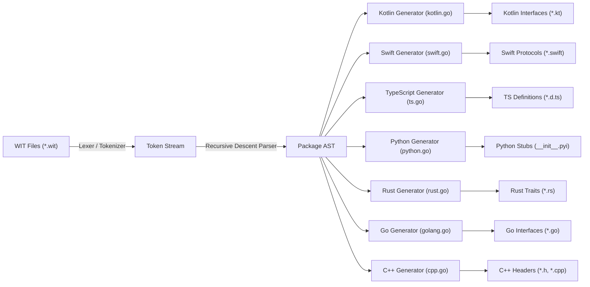
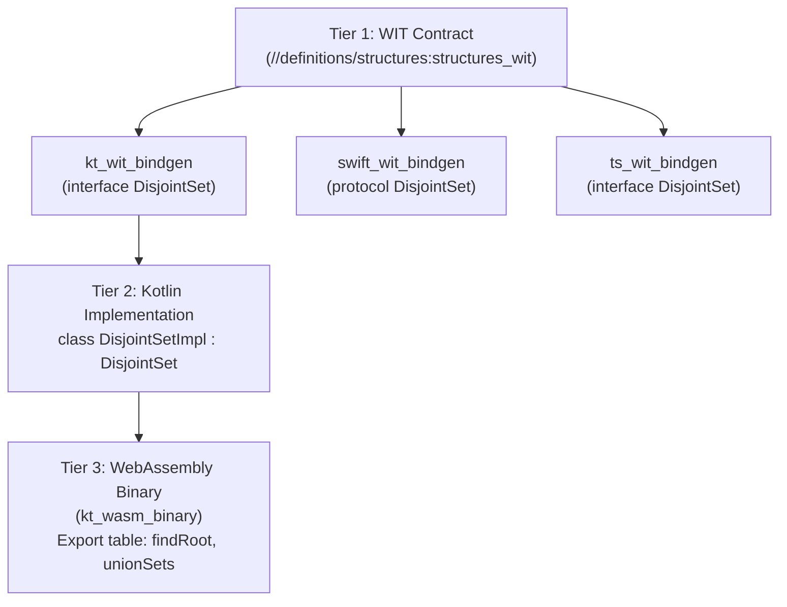

# WIT Architecture & AST Parsing Design

This document details the architectural design of `please_wit`, the
self-contained AST parser, and cross-language contract generation.

---

## 1. Self-Contained Pure Go Architecture

Generating language bindings and interface definitions from WIT schemas
traditionally relied on external precompiled binaries. This introduced several
major challenges:

- **Heavyweight Toolchains**: Required downloading platform-specific tarballs
  (~50MB per platform/arch), causing slow toolchain bootstrapping and potential
  host glibc/musl compatibility issues.
- **Missing Language Support**: Upstream tools had no native generators for
  Kotlin, Swift, TypeScript, or Python interface contracts.
- **Contract vs. Runtime Mismatch**: For contract-driven 3-tier architectures,
  developers need clean, idiomatic interface contracts (e.g. traits, protocols,
  abstract classes), not heavy guest component wrappers.

By embedding a lightweight, recursive-descent lexer and LL(1) AST parser
directly inside `please_wit` (pure Go), `please-rules` completely eliminates all
external binary dependencies. Interface contracts for all 7 supported languages
are generated with sub-second execution, total hermeticity, and zero network
access.

---

## 2. Standalone Go AST Parser Architecture

`please_wit` embeds a lightweight lexer and parser in `tools/please_wit/ast`:

### AST Data Model

The AST models WIT declarations cleanly:

- `Package`: Namespace, package name, version, interfaces, and worlds.
- `Interface`: Interface name, functions, records, enums, and type aliases.
- `Function`: Name, parameters, and optional return type (`Results`).
- `TypeRef`: Supports primitives (`s32`, `string`, `bool`, etc.) and
  parameterized compound types (`list<T>`, `option<T>`, `result<T, E>`,
  `tuple<...>`).

---

## 3. Zero External Binary Dependencies

For contract and interface generation across all supported languages (Kotlin,
Swift, TypeScript, Python, Rust, Go, C++):

- `please_wit` compiles from source with Please's native Go rules.
- **No external binaries or tarballs are downloaded or required**.
- All binding rules (`kt_wit_bindgen`, `swift_wit_bindgen`, `ts_wit_bindgen`,
  `python_wit_bindgen`, `rust_wit_bindgen`, `go_wit_bindgen`, `cc_wit_bindgen`)
  execute instantly without toolchain bootstrap overhead.

---

## 4. Multi-Language 3-Tier DAG

This architecture cleanly enables contract-driven architectures across
multi-language monorepos:

