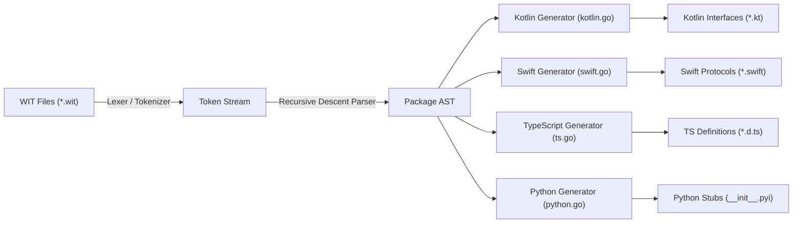
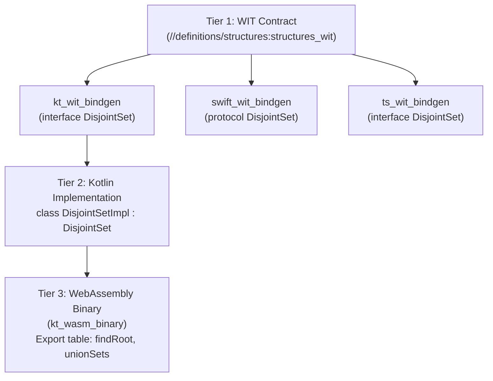

# WIT Architecture & AST Parsing Design

This document details the architectural design of `please_wit`, the
self-contained AST parser, and cross-language contract generation.

---

## 1. The Challenge with Upstream `wit-bindgen`

Upstream BytecodeAlliance `wit-bindgen` is designed primarily for Wasm Component
Model Guest and Host runtimes in low-level systems languages (Rust, Go, C/C++,
C#). It offers **no native code generators** for:

- **Kotlin**
- **Swift**
- **TypeScript**
- **Python**

Previously, attempting to generate code for these languages either failed or
required falling back to C headers and generating empty marker files. Developers
writing implementations (e.g. `class DisjointSetImpl : DisjointSet`) lacked the
generated interface definitions to implement.

---

## 2. Standalone Go AST Parser Architecture

`please_wit` embeds a lightweight, recursive-descent lexer and LL(1) parser in
`tools/please_wit/ast`:

### AST Data Model

The AST models WIT declarations cleanly:

- `Package`: Namespace, package name, version, interfaces, and worlds.
- `Interface`: Interface name, functions, records, enums, and type aliases.
- `Function`: Name, parameters, and optional return type (`Results`).
- `TypeRef`: Supports primitives (`s32`, `string`, `bool`, etc.) and
  parameterized compound types (`list<T>`, `option<T>`, `result<T, E>`,
  `tuple<...>`).

---

## 3. Zero External Binary Dependencies

For contract and interface generation across Kotlin, Swift, TypeScript, and
Python:

- `please_wit` runs **100% in Go**.
- **No `wit-bindgen` or `wasm-tools` tarball downloads are required**.
- Build rules (`kt_wit_bindgen`, `swift_wit_bindgen`, `ts_wit_bindgen`,
  `python_wit_bindgen`) execute instantly without toolchain bootstrap overhead.

---

## 4. Multi-Language 3-Tier DAG

This architecture cleanly enables contract-driven architectures across
multi-language monorepos:

